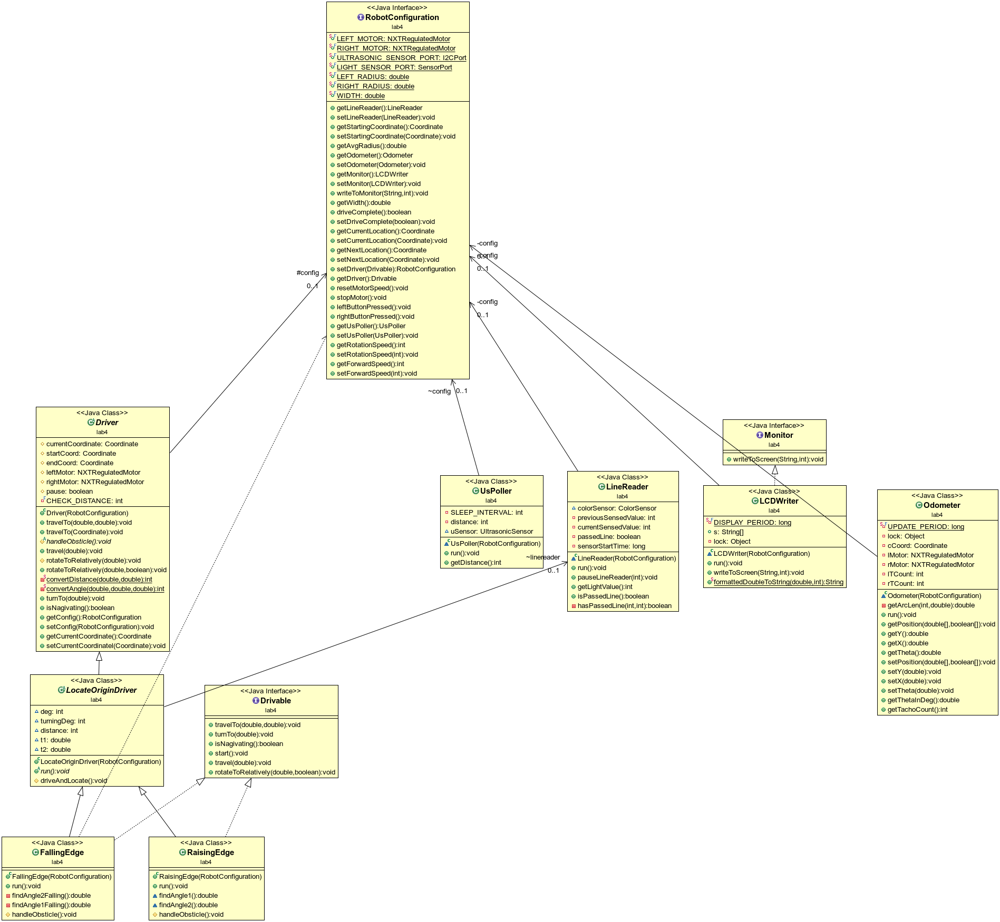

ecse211 - design principle methods
=======

Readme file for the ecse 211 project
===
Class diagram of important classes as  of lab 4 
---



**RobotConfiguration:** contains a reference to all the important components such as:

- odometer
- Driver 
- Ultrasond Poller 
- Line Reader (uses the color sensor to detect line)
- LCDWriter 

below explains each of the import classes.Note the following does not cover all of the classes but only the major structures.

classes 
---
###Drivable <interface>
defines common behavior of classes that can be used as motor drivers 

###Driver
abstract class that defines common behaviors related to motor movement. RisingEdge and fallingEdge are its subclasses.

###LocateOriginDriver 
extends Driver.it defines a more specific case of driver and contains the common behavior of risingEdge and fallingEdge.

### RisingEdge/FallingEdge
Extend LocateOriginDriver, they are the concrete class that Implement Drivable 

###UsPoller 
ultrasonic poller 

### LineReader 
Reads the line on the ground using a colorSensor, the public method isPassedLine() returns true when a line has crossed. Problem with this is that other classes need to poll this value very frequently inorder to not miss a line. *Possible improvement may be using Event Driven machanisms.*

###LCDWriter 
writes on the LCD basically.only important values should be written on screen since RConsole has greater freedom in the length of the message.
**NOTE:** this method should only be called in the main method, grouping the writeToScreen method together at one place will save a lot of trouble to find all of them... 

###Monitor <interface>
defines the behavior of writing to a display such as the LCD display.

###Odometer
updates the currentLocation (an instance of Coordinate class) in the Configuration class(an concrete implementation of RoboConfig).


Future improvements 
===
for lab 5 : 
- make classes that implement threads singletons. Also make them instantiated from static factories to avoid having to keep a big configuration class. The threads should be instatiated (once and only once) implicitly by the factory methods and return to who ever calls it.
- RoboConfig should only contain current/destination/start coordinates and robot wheel sizes and such.
- not sure how event driven works but it seems the way to do if many object need to get the same data from lineReader

###lab 2 

light sensor correction algo:

```java
 move forward ;
boolean firstLineDetection = false ;

while (true){
      if (Odometer.getPositive() == true){
      	 firstLineDetection = true ;
      	 
```

lab 2 is currently done.

the final code is taged as lab2Done

**line detection code is very solid** and can be used for further projects
